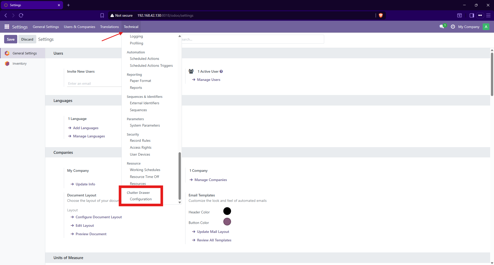
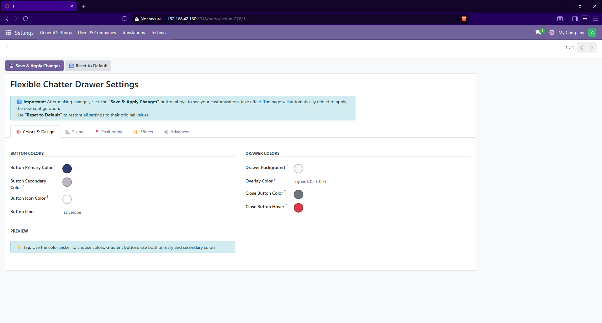
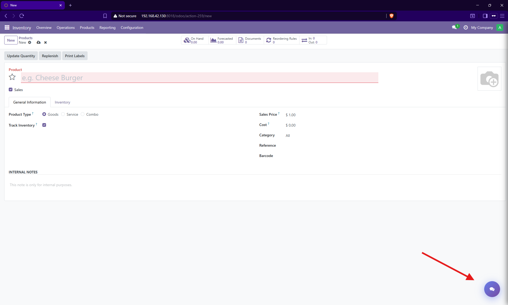

# Flexible Chatter Drawer

Transform your Odoo chatter into a beautiful, customizable floating drawer with extensive customization options!

## 🌟 Features

### Core Features
- **Floating Button**: Elegant floating button to access chatter from anywhere
- **Slide-in Drawer**: Smooth slide-in drawer animation with customizable transitions
- **Universal Application**: Works automatically on ALL form views
- **Zero Code**: No coding required - just install and configure

### Customization Options

#### 🎨 Colors & Design
- Button gradient colors (primary and secondary)
- Drawer background color
- Overlay opacity and color
- Close button styling

#### 📐 Size & Dimensions
- Button size (width and height)
- Button border radius (circular or rounded square)
- Drawer width (percentage or pixels)
- Shadow intensity

#### 📍 Positioning
- Button position: Bottom-Right, Bottom-Left, Top-Right, Top-Left
- Drawer side: Right or Left
- Custom spacing from edges
- Z-index control

#### ✨ Effects & Animations
- Enable/disable animations
- Pulse effect on button
- Slide animation speed
- Overlay fade effect

#### ♿ Accessibility
- High contrast mode support
- Reduced motion support
- Keyboard navigation ready
- Screen reader friendly

#### 🌙 Theme Support
- Automatic dark mode detection
- Custom dark mode colors
- Theme-aware styling

## 📦 Installation

1. Download the module
2. Copy to your Odoo addons directory
3. Update the Apps list (Apps > Update Apps List)
4. Search for "Flexible Chatter Drawer"
5. Click Install

## ⚙️ Configuration

After installation, configure the drawer:

1. Go to **Settings > Technical > Chatter Drawer Configuration**
2. Customize the options:
   - **Colors Tab**: Set button and drawer colors
   - **Sizing Tab**: Adjust button and drawer dimensions
   - **Position Tab**: Choose button and drawer placement
   - **Effects Tab**: Enable/disable animations and effects
   - **Advanced Tab**: Fine-tune advanced options

3. Save your settings
4. Refresh the page to see changes

## 🎯 Use Cases

- **Clean Interface**: Keep your form views clean and uncluttered
- **Better Space**: Maximize form real estate for important fields
- **Modern UX**: Provide a modern, app-like user experience
- **Mobile-Friendly**: Better mobile experience with collapsible chatter
- **Multi-User**: Different users can have different preferences

## 📸 Screenshots

### Default Configuration

### Custom Colors

### Mobile View

## 🔧 Technical Details

- **Version**: 18.0.1.0.0
- **Odoo Versions**: 18.0
- **Dependencies**: base, mail, web
- **License**: LGPL-3
- **Technology**: OWL (Odoo Web Library), JavaScript, CSS

## 🤝 Support

For support, feature requests, or bug reports:
- Email: support@yourcompany.com
- Website: https://www.yourcompany.com
- Documentation: https://docs.yourcompany.com

## 📄 License

This module is licensed under LGPL-3. See LICENSE file for details.

## 🚀 Roadmap

- [ ] Per-user configuration
- [ ] Multiple floating buttons
- [ ] Notification badges
- [ ] Custom button icons
- [ ] Export/Import configurations
- [ ] Preset themes

## 👨‍💻 Author

**Your Company**
- Website: https://www.yourcompany.com
- Email: info@yourcompany.com

## 🙏 Credits

Built with ❤️ for the Odoo community.

---

*If you find this module useful, please consider giving it a ⭐ on the Odoo Apps Store!*

